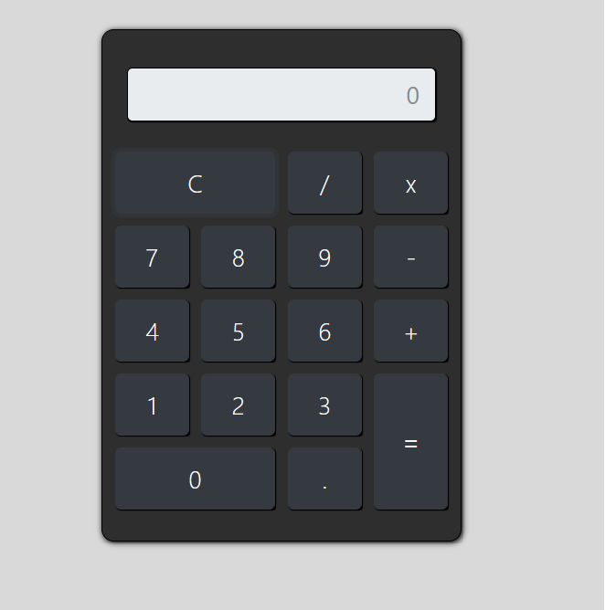

<h1 align="center">
  <strong>Calculadora</strong>
</h1>

<p align="center">
🗣👥 Calculadora simples com html, css e javascript.
</p>

## 🎨 Screen

<div align="center">
  
</div>

## 🧰 Tools

- [HTML]()
- [CSS]()
- [JavaScript]()

## 🚧 Installation

```sh
  $ git clone https://github.com/joaobr200/calculadora_simples

  $ open index.html
```

## 🙅🏽‍♂️ Author

- **João Vitor** - [Joaobr200](https://github.com/joaobr200)
